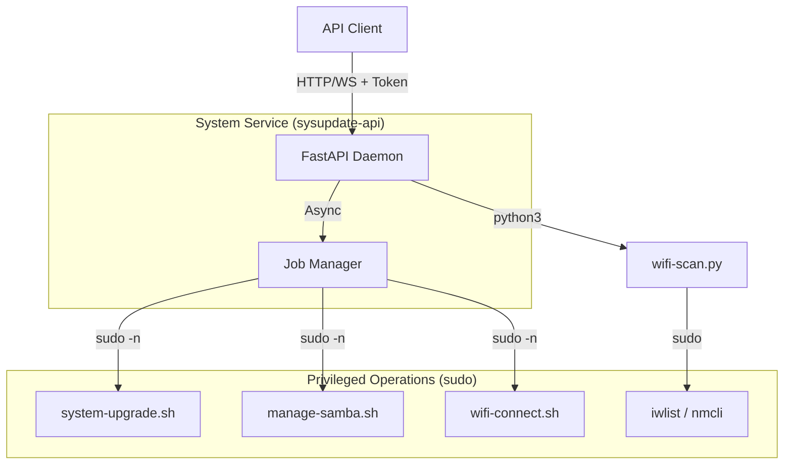

# PINS Daemon (System Management API)

A lightweight, secure, Python-based daemon designed for the Raspberry Pi to expose system management capabilities via a REST API. It handles system updates, Samba share management, and Wi-Fi configuration.

## Features

- **System Updates**: Trigger `apt update && apt upgrade` remotely.
- **Samba Management**: Enable or disable SMB shares for file access.
- **Wi-Fi Management**: Scan for available networks and connect to them securely.
- **Secure Architecture**:
  - Runs as a restricted user (`sysupdate-api`).
  - No shell injection: Commands are hard-coded or strictly parameterized.
  - Privileges delegated via `sudoers` (no root API access).
  - Bearer Token authentication.
- **Real-time Feedback**: WebSocket endpoint for streaming command execution logs.

## High-Level Design



The daemon provides a facade over system shell scripts. Long-running tasks (like upgrades or Wi-Fi connections) are executed asynchronously as "Jobs". Clients receive a `Job ID` immediately and can use it to poll status or stream logs via WebSockets.

## API Endpoints

All HTTP endpoints require the `Authorization: Bearer <token>` header.

### 1. System Upgrade

Triggers a system package upgrade.

- **URL**: `POST /upgrade`
- **Body**:
  ```json
  {
    "dryRun": false
  }
  ```
- **Response**: `JobResponse` object.

### 2. Samba Management

Enable or disable the file sharing service.

- **URL**: `POST /samba`
- **Body**:
  ```json
  {
    "enable": true
  }
  ```
- **Response**: `JobResponse` object.

### 3. Wi-Fi Scan

Get a list of available Wi-Fi networks.

- **URL**: `GET /wifi/scan`
- **Response**: List of network objects.
  ```json
  [
    {
      "ssid": "MyWiFi",
      "signal_strength": -55,
      "quality": "60/70",
      "encrypted": true,
      "channel": 6,
      "frequency": 2.437,
      "mac": "00:11:22:33:44:55"
    }
  ]
  ```

### 4. Wi-Fi Connect

Connect to a specific Wi-Fi network. If connection fails, it automatically reverts to Hotspot mode.

- **URL**: `POST /wifi/connect`
- **Body**:
  ```json
  {
    "ssid": "MyWiFi",
    "password": "secretpassword"
  }
  ```
- **Response**: `JobResponse` object.

### 5. Job Status

Check the status of a background job.

- **URL**: `GET /jobs/{jobId}`
- **Response**: `JobResponse` object.

### 6. Job Logs (WebSocket)

Stream live logs from a running job.

- **URL**: `ws://<host>:8000/logs/{jobId}?token=<token>`
- **Output**: Real-time text stream of stdout/stderr.

---

## Data Models

**JobResponse**
```json
{
  "jobId": "uuid-string",
  "status": "started|running|success|failed",
  "exitCode": null,
  "startedAt": 1678900000.0,
  "finishedAt": null,
  "command": "sudo ..." 
}
```

## Installation

### From Debian Package (Recommended on Pi)

1.  Download the latest `.deb` release.
2.  Install:
    ```bash
    sudo apt update
    sudo apt install ./pinsdaemon_*_arm64.deb
    ```
3.  The service `sysupdate-api` starts automatically.

### Manual / Development Setup

1.  **Prerequisites**: Python 3.9+, `venv`.
2.  **User Setup**:
    ```bash
    sudo useradd -r -s /bin/false sysupdate-api
    ```
3.  **Deploy Code**: Copy `app/` and `scripts/` to `/opt/pinsdaemon`.
4.  **Install Deps**:
    ```bash
    python3 -m venv venv
    ./venv/bin/pip install -r requirements.txt
    ```
5.  **Configure Sudoers**: Copy `packaging/sudoers` content to `/etc/sudoers.d/sysupdate-api`.
6.  **Run**:
    ```bash
    sudo /opt/pinsdaemon/venv/bin/uvicorn app.main:app --host 0.0.0.0 --port 8000
    ```
